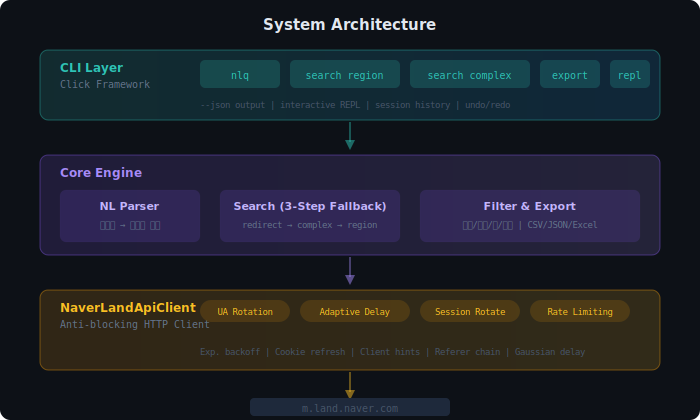
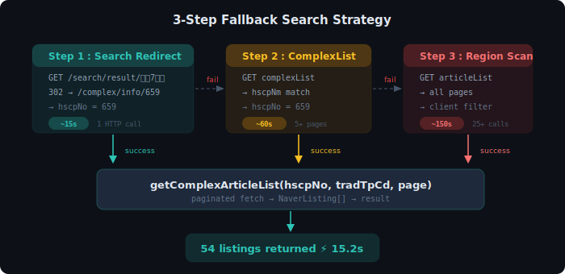
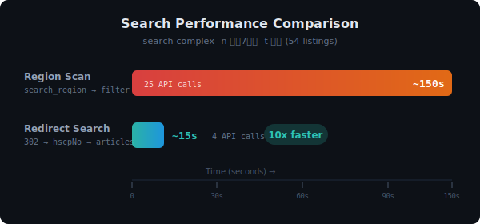

<p align="center">
  
</p>

<p align="center">
  <strong>네이버 부동산 매물 검색을 터미널에서. 전국 248개 지역, 자연어 한 줄로.</strong>
</p>

<p align="center">
  
  
  
  
</p>

<p align="center">
  
  
  
  
</p>

---

## Why CLI for Real Estate?

GUI 기반 부동산 검색은 반복 작업에 비효율적입니다. CLI는 **자동화, 파이프라이닝, AI 에이전트 연동**에 최적화된 인터페이스입니다.

| | GUI (네이버 부동산 앱) | CLI (이 도구) |
|---|---|---|
| **반복 검색** | 매번 클릭/스크롤 | 한 줄 명령어 재실행 |
| **데이터 추출** | 수동 복사 | `export csv/json/excel` |
| **조건 조합** | 제한된 필터 UI | 자유로운 필터 조합 |
| **AI 에이전트** | 불가 | `--json` 플래그로 즉시 연동 |
| **자동화** | 불가 | 셸 스크립트, cron, 파이프라인 |

---

## Key Features

| 기능 | 설명 | 성능 |
|------|------|------|
| **자연어 검색** | `nlq 강남 30평대 매매 10억 이하` | 한 줄로 완료 |
| **고속 단지 검색** | 검색 리다이렉트 → hscpNo 즉시 조회 | **~15초** (기존 ~150초) |
| **전국 248개 지역** | 17개 시/도, 모든 구/군/시 | 서울은 `-c` 생략 가능 |
| **확장 필터** | 평형, 가격, 층수, 날짜, 태그 | 복수 조건 조합 |
| **3종 내보내기** | CSV, JSON, Excel | 데이터 분석 즉시 연결 |
| **대화형 REPL** | 인터랙티브 연속 검색 | 세션/히스토리/undo |
| **Anti-blocking** | UA 로테이션, 세션 관리, 적응형 딜레이 | 안정적 대량 수집 |
| **결과 캐시** | 동일 조건 5분 TTL | 재검색 즉시 반환 |

---

## Architecture

<p align="center">
  
</p>

### High-Speed Search: 3-Step Fallback

<p align="center">
  
</p>

<p align="center">
  
</p>

---

## Quick Start

### Installation

```bash
git clone https://github.com/humanist96/cli-anything-naver-land.git
cd cli-anything-naver-land
pip install -e .
```

> **macOS 사용자:** `pip install`이 `~/Library/Python/3.x/bin/`에 스크립트를 설치합니다.
> `cli-anything-naver-land` 명령어가 안 되면 PATH를 추가하세요:
> ```bash
> echo 'export PATH="$HOME/Library/Python/3.9/bin:$PATH"' >> ~/.zshrc
> source ~/.zshrc
> ```
> Python 버전에 따라 `3.9`를 `3.10`, `3.11` 등으로 변경하세요.

<details>
<summary>다른 설치 방법</summary>

```bash
# 바로 설치
pip install git+https://github.com/humanist96/cli-anything-naver-land.git

# Excel 내보내기 포함
pip install -e ".[excel]"
```

</details>

### 30 Seconds Demo

```bash
# 자연어 검색 — 가장 쉬운 방법
cli-anything-naver-land nlq 강남 30평대 매매 10억 이하

# 단지명 고속 검색 — 구 지정 불필요
cli-anything-naver-land search complex -n 목동7단지 -t 매매

# 전국 검색
cli-anything-naver-land search region -c 부산 -d 해운대구 -t 전세

# JSON 출력 (AI 에이전트 연동)
cli-anything-naver-land --json search region -d 종로구 -t 매매
```

---

## Usage

### 자연어 검색 (NLQ)

한국어로 자연스럽게 검색합니다. 파서가 거래유형, 지역, 평형, 가격, 정렬, 내보내기를 자동 인식합니다.

```bash
cli-anything-naver-land nlq 강남 30평대 매매 10억 이하
cli-anything-naver-land nlq 부산 해운대 전세 84㎡ 이상
cli-anything-naver-land nlq 서초구 반포자이 매매 제일 싼거
cli-anything-naver-land nlq 종로구 전체 매물 csv로 저장
cli-anything-naver-land nlq 강남구 매매 5억~15억
```

<details>
<summary>자연어 파서 인식 키워드</summary>

| 카테고리 | 키워드 |
|----------|--------|
| 거래유형 | 매매, 전세, 월세, 단기임대 |
| 평형 | 소형, 20평대, 30평대, 중대형 |
| 가격 | `10억 이하`, `5억 이상`, `5억~15억` |
| 면적 | `84㎡ 이상`, `30평 이하` |
| 층수 | `20층 이상`, `5층 이하` |
| 정렬 | 싼, 저렴한, 최신, 넓은 |
| 내보내기 | csv, json, excel, 저장, 다운로드 |

</details>

### 지역 검색

```bash
# 서울 (구 이름만으로 검색)
cli-anything-naver-land search region -d 강남구 -t 매매

# 전국 (-c로 시/도 지정)
cli-anything-naver-land search region -c 부산시 -d 해운대구 -t 매매
cli-anything-naver-land search region -c 경기도 -d 분당구 -t 전세
```

> **참고:** 서울은 `-c` 없이도 자동 검색됩니다. 다른 시/도는 `-c`로 지정하세요.

### 단지명 검색 (High-Speed)

```bash
# 단지명만으로 즉시 검색 — 구 지정 불필요
cli-anything-naver-land search complex -n 목동7단지
cli-anything-naver-land search complex -n 도곡렉슬
cli-anything-naver-land search complex -n 래미안목동아델리체

# 구 지정 시 fallback 보장
cli-anything-naver-land search complex -n 래미안 -d 강남구
cli-anything-naver-land search complex -n 엘시티 -d 해운대구 -c 부산시
```

### 필터

```bash
cli-anything-naver-land search region -d 강남구 -t 매매 \
  --type 30평대 --min-price 5억 --max-price 15억 --floor 10+ \
  --tag 역세권 --since 2026-03-01
```

### 내보내기

```bash
cli-anything-naver-land export csv -o 강남_매매.csv
cli-anything-naver-land export json -o 강남_매매.json
cli-anything-naver-land export excel -o 강남_매매.xlsx
```

---

## REPL Mode (Interactive)

인자 없이 실행하면 **대화형 모드(REPL)** 로 진입합니다. 터미널(iTerm, Terminal.app 등)에서 직접 실행해야 합니다.

> **참고:** REPL은 키보드 입력이 필요한 인터랙티브 모드이므로, 반드시 **터미널에서 직접 실행**하세요. 파이프 입력이나 비대화형 환경(CI, IDE 내장 터미널 등)에서는 일반 모드(`cli-anything-naver-land search ...`)를 사용하세요.

```bash
# 터미널에서 실행
cli-anything-naver-land
```

```
╭──────────────────────────────────────────────────────╮
│ ◆  cli-anything · Naver Land                         │
│    v1.0.0                                            │
│                                                      │
│    Type help for commands, quit to exit              │
╰──────────────────────────────────────────────────────╯

◆ naver_land ❯ search complex -n 목동7단지 -t 매매
  단지명            | 거래 | 면적             | 분류   | 가격       | 층
  ------------------+------+------------------+--------+------------+-------
  목동신시가지7단지 | 매매 | 30.6평 (101.2㎡) | 30평대 | 40억       | 7/15
  목동신시가지7단지 | 매매 | 20.1평 (66.6㎡)  | 20평대 | 28억 5,000 | 10/15
  ...
  총 54건

◆ naver_land ❯ nlq 강남 30평대 매매 10억 이하
  (검색 → 필터 → 결과 출력)

◆ naver_land ❯ export csv -o 결과.csv
  (내보내기 완료)

◆ naver_land ❯ quit
```

**REPL의 장점:**
- 세션/쿠키 재사용으로 연결 시간 절약
- 검색 → 필터 → 내보내기 연속 작업
- 명령 히스토리, undo/redo 지원

| 명령어 | 설명 |
|--------|------|
| `nlq <자연어>` | 자연어 검색 |
| `search region -d <구>` | 지역 검색 |
| `search complex -n <단지명>` | 단지명 고속 검색 |
| `search cities` | 시/도 목록 |
| `search districts [-c <시/도>]` | 구/군 목록 |
| `search url [-a 매물번호]` | 매물/지도 URL 생성 |
| `filter apply --type 30평대` | 필터 적용 |
| `filter clear` | 필터 초기화 |
| `export csv -o <파일>` | 내보내기 |
| `session history` | 명령 히스토리 |
| `session undo / redo` | 되돌리기 |

---

## Demonstration

실제 검색 결과 예시:

```
$ cli-anything-naver-land search complex -n 목동7단지 -t 매매

  단지명            | 거래 | 면적             | 분류   | 가격       | 층
  ------------------+------+------------------+--------+------------+-------
  목동신시가지7단지 | 매매 | 30.6평 (101.2㎡) | 30평대 | 40억       | 7/15
  목동신시가지7단지 | 매매 | 30.6평 (101.2㎡) | 30평대 | 36억 5,000 | 8/15
  목동신시가지7단지 | 매매 | 20.1평 (66.6㎡)  | 20평대 | 28억 5,000 | 10/15
  목동신시가지7단지 | 매매 | 16.3평 (53.88㎡) | 소형   | 24억       | 10/15
  ...

  총 54건  ⏱ 15.2초
```

```
$ cli-anything-naver-land search region -d 종로구 -t 매매

  종로구 검색 결과
  ──────────────────────────────
  총 매물:    576건
  가격 범위:  2억 3,000 ~ 85억
  평균 가격:  15억 4,200
  평형 분포:  소형 89건 | 20평대 201건 | 30평대 178건 | 중대형 108건
```

---

## Reference

<details>
<summary>시/도 목록 (17개)</summary>

| 시/도 | 구/군 수 | 약칭 |
|-------|---------|------|
| 서울특별시 | 25 | `서울`, `서울시` |
| 부산광역시 | 16 | `부산`, `부산시` |
| 대구광역시 | 9 | `대구`, `대구시` |
| 인천광역시 | 10 | `인천`, `인천시` |
| 광주광역시 | 5 | `광주`, `광주시` |
| 대전광역시 | 5 | `대전`, `대전시` |
| 울산광역시 | 5 | `울산`, `울산시` |
| 세종특별자치시 | 1 | `세종`, `세종시` |
| 경기도 | 42 | `경기`, `경기도` |
| 강원특별자치도 | 18 | `강원`, `강원도` |
| 충청북도 | 14 | `충북`, `충청북도` |
| 충청남도 | 16 | `충남`, `충청남도` |
| 전북특별자치도 | 15 | `전북`, `전라북도` |
| 전라남도 | 22 | `전남`, `전라남도` |
| 경상북도 | 23 | `경북`, `경상북도` |
| 경상남도 | 22 | `경남`, `경상남도` |
| 제주특별자치도 | 2 | `제주`, `제주도` |

</details>

<details>
<summary>거래유형 / 부동산유형 / 정렬</summary>

**거래유형 (`-t`)**

| 값 | 코드 |
|----|------|
| `매매` | A1 |
| `전세` | B1 |
| `월세` | B2 |
| `단기임대` | B3 |

**부동산유형 (`-p`)**

| 값 | 설명 |
|----|------|
| `APT` | 아파트 (기본값) |
| `VL` | 빌라/연립 |
| `OPST` | 오피스텔 |
| `OR` | 주거용오피스텔 |
| `ABYG` | 아파트분양권 |
| `JGC` | 재건축 |
| `DDDGG` | 단독/다가구 |

**정렬 (`--sort`)**

| 값 | 설명 |
|----|------|
| `rank` | 추천순 (기본값) |
| `prc` | 가격순 |
| `spc` | 면적순 |
| `date` | 최신순 |

</details>

<details>
<summary>필터 옵션 전체</summary>

| 옵션 | 설명 | 예시 |
|------|------|------|
| `--type` | 평형 분류 | `--type 30평대` |
| `--min-price` | 최소 가격 | `--min-price 5억` |
| `--max-price` | 최대 가격 | `--max-price 15억` |
| `--min-area` | 최소 면적(㎡) | `--min-area 84` |
| `--max-area` | 최대 면적(㎡) | `--max-area 120` |
| `--floor` | 층수 필터 | `--floor 10+`, `--floor 3-10` |
| `--since` | 확인일 시작 | `--since 2026-03-01` |
| `--until` | 확인일 끝 | `--until 2026-03-31` |
| `--tag` | 태그 (복수 가능) | `--tag 역세권 --tag 신축` |
| `--name-contains` | 단지명 포함 | `--name-contains 래미안` |

</details>

---

## FAQ

<details>
<summary><strong>"구"를 빼고 검색해도 되나요?</strong></summary>

네. `강남` → `강남구`, `해운대` → `해운대구`, `분당` → `성남시 분당구`로 자동 인식됩니다.

</details>

<details>
<summary><strong>"중구"처럼 여러 도시에 있는 지역은?</strong></summary>

자동 감지하여 선택을 요청합니다. `-c 부산`처럼 시/도를 지정하면 해당 도시의 중구를 검색합니다.

```
⚠ '중구'이(가) 여러 도시에 있습니다:
  [1] 서울시 중구  [2] 부산시 중구  [3] 대구시 중구 ...
→ -c 옵션으로 시/도를 지정하세요 (예: -c 부산)
```

</details>

<details>
<summary><strong>검색 속도가 느려요</strong></summary>

네이버 API 부하 방지를 위한 딜레이가 포함되어 있습니다. **단지명 검색**(`search complex -n`)은 검색 리다이렉트를 활용해 ~15초로 완료됩니다. 동일 조건 재검색은 5분 캐시로 즉시 반환됩니다.

</details>

<details>
<summary><strong>Excel 내보내기가 안 돼요</strong></summary>

```bash
pip install openpyxl
# 또는
pip install -e ".[excel]"
```

</details>

---

## Tech Stack

| Component | Technology |
|-----------|-----------|
| CLI Framework | [Click](https://click.palletsprojects.com/) |
| HTTP Client | [Requests](https://docs.python-requests.org/) + custom anti-blocking |
| Data Model | Python dataclasses (frozen, immutable) |
| Testing | pytest (82 tests, 100% pass) |
| Export | CSV, JSON, openpyxl (Excel) |

## License

MIT License
